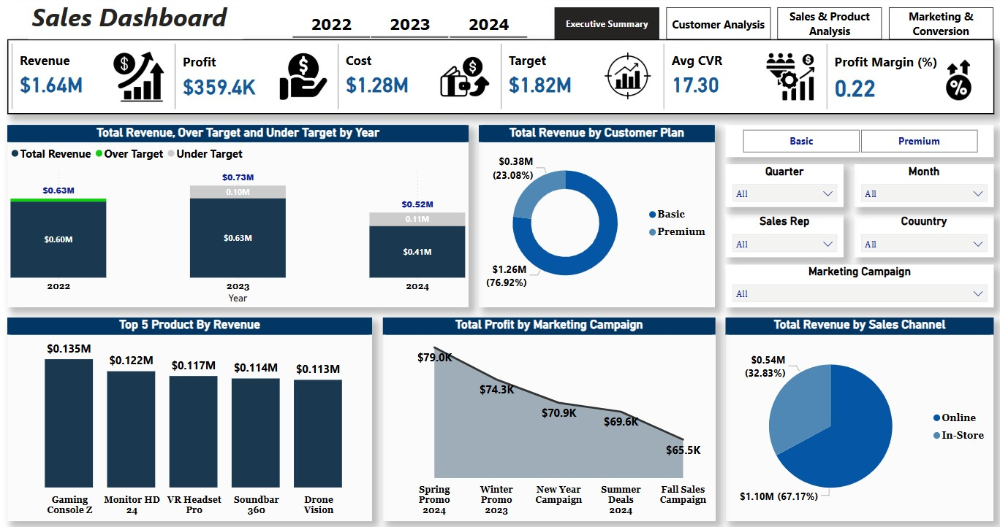
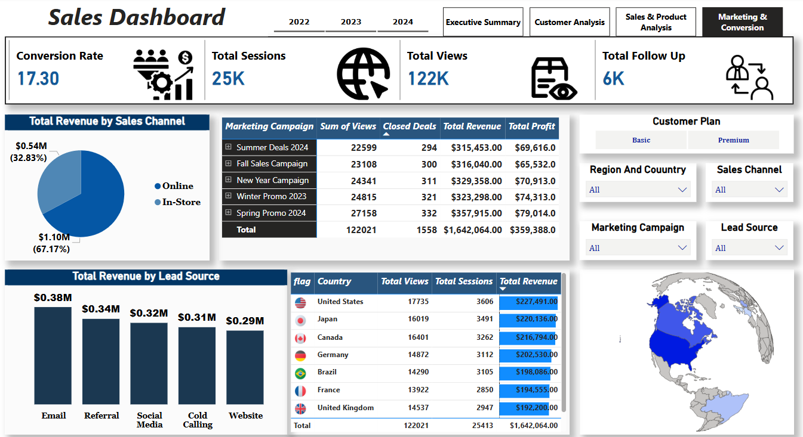
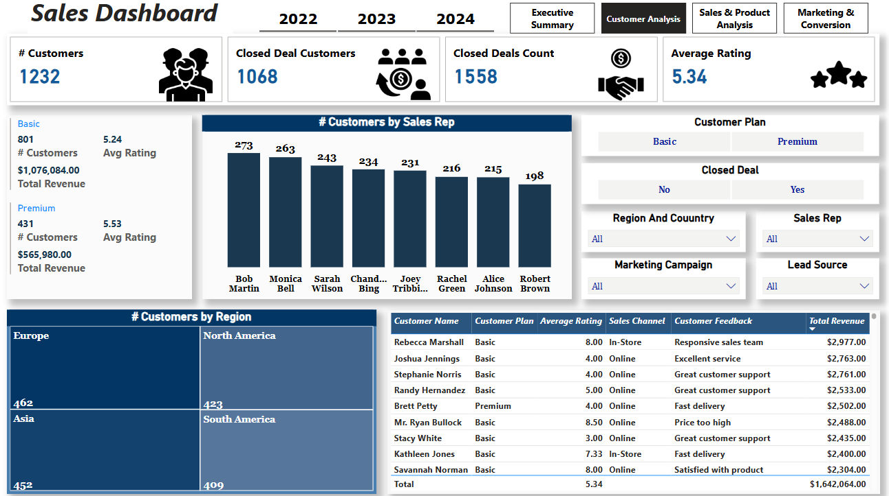
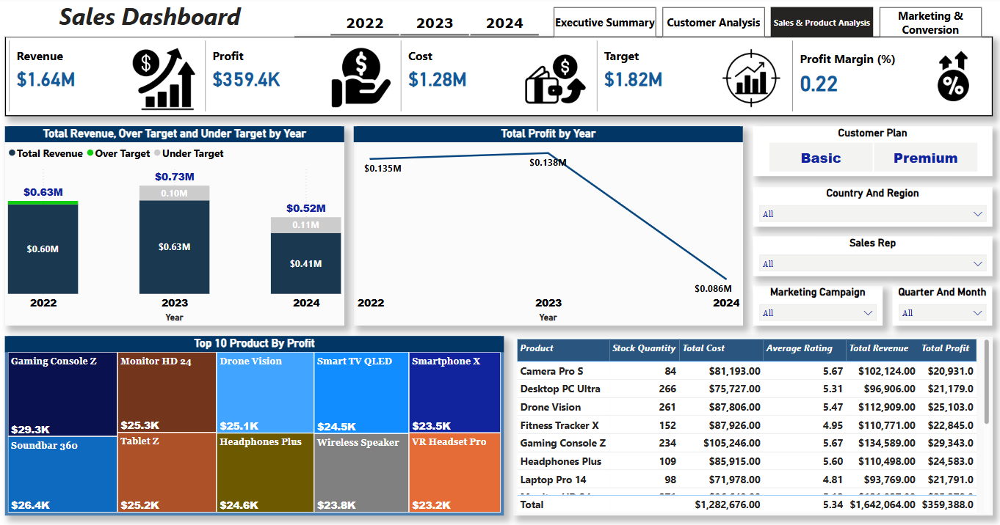

# E-commerce Sales Dashboard

## Project Overview
The E-commerce Sales Dashboard project is designed to provide a comprehensive analysis of online sales data, offering deep insights into sales performance, customer behavior, product trends, and marketing effectiveness. The goal is to empower stakeholders with actionable intelligence to optimize sales strategies, enhance customer engagement, and drive business growth. This dashboard features multiple interactive views for detailed exploration.

## Tools Used
- **Microsoft Power BI**: For data ingestion, transformation, analysis, visualization, and interactive dashboard creation.

## Data Cleaning (Assumed Steps - customize if different)
The data preparation process involved several steps to ensure the dataset was accurate and ready for analysis:
- Handling Missing Values: Addressed missing data in critical fields by appropriate methods (e.g., imputation for numerical data if suitable, or flagging/removing records with incomplete essential information).
- Data Formatting: Ensured consistency in data types (e.g., dates converted to date format, monetary values to numeric, categorical data standardized).
- Removing Duplicates: Identified and removed any duplicate transaction or customer records to maintain data integrity.
- Outlier Review: Potentially reviewed significant outliers in sales figures or quantities for validation.

## Exploratory Data Analysis (EDA) & Key Dashboard Features
EDA was performed through the interactive Power BI dashboard, allowing for dynamic exploration of various facets of the e-commerce business:

-   **Executive Summary View**:
    *   **Overall Performance KPIs**: Tracked key metrics such as Total Revenue (e.g., $1.64M), Total Profit (e.g., $359.4K), Total Cost (e.g., $1.28M), and Target Revenue (e.g., $1.82M).
    *   **Profitability**: Monitored Profit Margin (e.g., 0.22) and Average Conversion Rate (e.g., 17.30%).
    *   **Yearly Trends**: Visualized Total Revenue Over/Under Target by Year (e.g., 2022, 2023, 2024) and Total Profit by Year.

-   **Marketing & Conversion View**:
    *   **Engagement Metrics**: Analyzed Total Sessions (e.g., 25K), Total Views (e.g., 122K), and Total Follow-Ups (e.g., 6K).
    *   **Sales Channel Performance**: Compared revenue from different sales channels (e.g., Online vs. In-Store).
    *   **Marketing Campaign Analysis**: Assessed performance of various marketing campaigns (e.g., Summer Deals 2024, Fall Sales Campaign) based on Sum of Views, Closed Deals, Total Revenue, and Total Profit.
    *   **Lead Source Effectiveness**: Evaluated revenue generated from different lead sources (e.g., Email, Referral, Social Media, Cold Calling, Website).
    *   **Geographical Sales Distribution**: Visualized total views, sessions, and revenue by country using an interactive map.

-   **Customer Analysis View**:
    *   **Customer Overview**: Tracked total number of Customers (e.g., 1232), Closed Deal Customers (e.g., 1068), and Closed Deals Count (e.g., 1558).
    *   **Customer Satisfaction**: Monitored Average Rating (e.g., 5.34).
    *   **Customer Segmentation**: Analyzed customer metrics (number, total revenue, average rating) by Customer Plan (Basic vs. Premium) and by Sales Representative.
    *   **Regional Customer Distribution**: Visualized customer counts by region (e.g., Europe, North America, Asia, South America).

-   **Sales & Product Analysis View**:
    *   **Product Performance**: Identified Top 10 Products by Profit and Revenue (e.g., Gaming Console Z, Monitor HD 24, Drone Vision).
    *   **Detailed Product Metrics**: Provided a table with individual product details including Stock Quantity, Total Cost, Average Rating, Total Revenue, and Total Profit.

## Key Insights & Results (Derived from Dashboard)
The interactive dashboard provides crucial insights, including but not limited to:
- Overall Business Health: Clear visualization of revenue, profit, and progress against targets.
- Marketing Effectiveness: Identification of high-performing marketing campaigns and lead sources, enabling optimized marketing spend.
- Sales Channel Optimization: Understanding which sales channels drive the most revenue and engagement.
- Customer Understanding: Insights into customer demographics, plan preferences, and satisfaction levels, guiding retention and acquisition strategies.
- Product Portfolio Management: Identification of top-selling and most profitable products, informing inventory and marketing focus.
- Regional Performance: Highlighting key geographical markets and areas for potential growth.

## Screenshots

*(You will need to ensure your image files are correctly named and placed in the repository, in the same directory as this README.md file, or update the paths accordingly.)*

### Executive Summary

### Marketing & Conversion Analysis

### Customer Analysis

### Sales & Product Analysis

